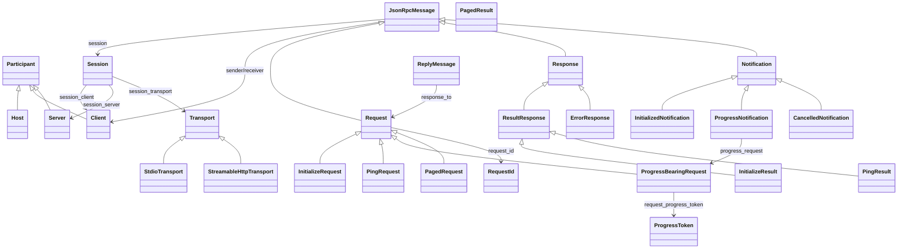

# Model Context Protocol Design

This document refines [`MCP-2025-11-25.spec.md`](./MCP-2025-11-25.spec.md) into an implementable ATN design.

## Design Drivers

- Preserve the specified host-client-server architecture, isolated client-server sessions, and JSON-RPC request, response, and notification discipline.
- Allocate responsibility for initialization ordering, request and response correlation, capability negotiation, transport adaptation, authorization binding, and feature-specific validation.
- Separate protocol core, transport, feature handling, authorization, and consent controls so implementations can vary without weakening specified constraints.
- Make explicit which components own state, registries, subscriptions, task lifecycle control, schema validation, and user-facing consent decisions.
- Preserve traceability from specification types, constants, relations, and assertions into implementable runtime elements and interfaces.

## Assumptions

- Hosts, clients, servers, and authorization servers may be realized as processes, libraries, or services, but this design treats them as components with explicit interfaces and state ownership.
- Stdio and Streamable HTTP are realized by transport adapters that present a common protocol boundary to the session coordinator.
- Capability negotiation is enforced through registries and dispatch checks rather than through ad hoc logic distributed across handlers.
- External standards such as JSON-RPC, OAuth, OpenID Connect discovery, and JSON Schema dialect handling are represented through MCP-facing components and controls rather than restated in full.
- Explicit user consent for tool invocation and sampling is enforced by host-side controls before corresponding protocol actions are allowed to proceed.
- Where the specification leaves implementation structure open, this design introduces coordinators, handlers, registries, stores, validators, and policies only to make responsibility allocation implementable and testable.

## Class Diagrams

### Protocol Core



### Session and Transport Runtime

```mermaid
classDiagram
    class HostRuntime
    class ClientRuntime
    class ServerRuntime
    class SessionCoordinator
    class LifecycleCoordinator
    class JsonRpcDispatcher
    class MessageCorrelator
    class SessionStateStore
    class RequestStateStore
    class TransportAdapter
    class StdioAdapter
    class StreamableHttpAdapter
    class TransportIngress
    class TransportEgress
    class ProtocolIngress
    class ProtocolEgress
    class HttpOriginValidator
    class HttpSessionBinder
    class Utf8Codec
    class SseStreamBridge
    class RequestIdAllocator
    class MessageNumberAllocator
    class ResponseRouter
    class ErrorMapper

    TransportAdapter <|-- StdioAdapter
    TransportAdapter <|-- StreamableHttpAdapter
    HostRuntime --> ClientRuntime : hosts
    SessionCoordinator --> LifecycleCoordinator : delegates initialization
    SessionCoordinator --> JsonRpcDispatcher : dispatches messages
    SessionCoordinator --> MessageCorrelator : correlates requests
    SessionCoordinator --> SessionStateStore : owns session state
    SessionCoordinator --> RequestStateStore : owns request state
    SessionCoordinator --> ProtocolIngress : protocol_ingress_of
    SessionCoordinator --> ProtocolEgress : protocol_egress_of
    StdioAdapter --> TransportIngress : transport_ingress_of
    StdioAdapter --> TransportEgress : transport_egress_of
    StreamableHttpAdapter --> TransportIngress : transport_ingress_of
    StreamableHttpAdapter --> TransportEgress : transport_egress_of
    StreamableHttpAdapter --> HttpOriginValidator : origin_validator_of
    StreamableHttpAdapter --> HttpSessionBinder : http_session_binder_of
    StreamableHttpAdapter --> SseStreamBridge : server streaming
    SessionCoordinator --> Utf8Codec : UTF-8 boundary
    SessionCoordinator --> RequestIdAllocator : allocates request ids
    SessionCoordinator --> MessageNumberAllocator : allocates message numbers
    SessionCoordinator --> ResponseRouter : routes replies
    SessionCoordinator --> ErrorMapper : maps protocol errors
```



### Resources, Tools, Sampling, and Tasks

```mermaid
classDiagram
    class PromptHandler
    class ResourceHandler
    class ResourceSubscriptionHandler
    class ToolHandler
    class CompletionHandler
    class LoggingHandler
    class RootsHandler
    class SamplingHandler
    class ElicitationHandler
    class TaskHandler
    class PromptRegistry
    class ResourceRegistry
    class ResourceTemplateRegistry
    class ToolRegistry
    class CompletionRegistry
    class RootRegistry
    class TaskRegistry
    class SubscriptionStore
    class TaskStateStore
    class ToolUseMatcher
    class TaskTransitionPolicy
    class ElicitationModePolicy
    class UrlElicitationTracker
    class Prompt
    class Resource
    class ResourceTemplate
    class Tool
    class Root
    class Task
    class ResourceSubscription

    PromptHandler --> PromptRegistry : prompt_registry_of
    ResourceHandler --> ResourceRegistry : resource_registry_of
    ResourceHandler --> ResourceTemplateRegistry : resource_template_registry_of
    ResourceSubscriptionHandler --> SubscriptionStore : uses_store
    ToolHandler --> ToolRegistry : tool_registry_of
    CompletionHandler --> CompletionRegistry : completion_registry_of
    RootsHandler --> RootRegistry : root_registry_of
    SamplingHandler --> ToolUseMatcher : tool_use_matcher_of
    ElicitationHandler --> ElicitationModePolicy : elicitation_mode_policy_of
    ElicitationHandler --> UrlElicitationTracker : url_elicitation_tracker_of
    TaskHandler --> TaskRegistry : task_registry_of
    TaskHandler --> TaskStateStore : uses_store
    TaskHandler --> TaskTransitionPolicy : task_transition_policy_of
    Prompt --> PromptHandler : served by
    Resource --> ResourceHandler : served by
    ResourceTemplate --> ResourceHandler : served by
    Tool --> ToolHandler : served by
    Root --> RootsHandler : served by
    Task --> TaskHandler : controlled by
    ResourceSubscription --> ResourceSubscriptionHandler : maintained by
```



### Authorization and Consent

```mermaid
classDiagram
    class AuthorizationHandler
    class AuthorizationStateStore
    class AuthorizationServerRegistry
    class ClientMetadataRegistry
    class ProtectedResourceMetadataResolver
    class AuthorizationServerDiscovery
    class PkceFlowCoordinator
    class BearerTokenInjector
    class TokenAudienceValidator
    class ToolConsentGate
    class SamplingConsentGate
    class SensitiveDataGuard
    class AuthorizationFlow
    class AccessToken
    class AuthorizedHttpSession
    class ProtectedResourceMetadata
    class AuthorizationServer
    class ClientMetadataDocument
    class ToolAuthorization
    class SamplingAuthorization

    AuthorizationHandler --> AuthorizationStateStore : uses_store
    AuthorizationHandler --> AuthorizationServerRegistry : authorization_server_registry_of
    AuthorizationHandler --> ClientMetadataRegistry : client_metadata_registry_of
    AuthorizationHandler --> ProtectedResourceMetadataResolver : protected_resource_resolver_of
    AuthorizationHandler --> AuthorizationServerDiscovery : authorization_discovery_of
    AuthorizationHandler --> PkceFlowCoordinator : pkce_flow_coordinator_of
    AuthorizationHandler --> BearerTokenInjector : bearer_token_injector_of
    AuthorizationHandler --> TokenAudienceValidator : token_validator_of
    AuthorizationFlow --> AuthorizationServer : selected_authorization_server
    AuthorizationFlow --> AccessToken : issued_token
    AuthorizationFlow --> ProtectedResourceMetadata : discovered from
    AuthorizedHttpSession --> AccessToken : session_access_token
    ClientMetadataDocument --> ClientMetadataRegistry : published in
    ToolAuthorization --> ToolConsentGate : enforced by host
    SamplingAuthorization --> SamplingConsentGate : enforced by host
    SensitiveDataGuard --> AuthorizationHandler : protects data handling
```



## ATN Design

```haskell
-- Design structure:
DesignComponent
DesignInterface
DesignDecision
ValidationRule
StateStore
ProtocolHandler
FeatureHandler: ProtocolHandler
TransportAdapter: DesignComponent
SecurityControl: DesignComponent
RegistryComponent: DesignComponent
SessionScopedStore: StateStore

component_name: DesignComponent -> String
interface_name: DesignInterface -> String
owned_by: DesignInterface -> DesignComponent
connects_to: DesignInterface -> DesignInterface
responsible_for: DesignComponent -> {ProtocolHandler}
decision_of: DesignDecision -> DesignComponent
validated_by: ValidationRule -> DesignComponent
uses_store: DesignComponent -> StateStore
store_session: SessionScopedStore -> Session

-- Core runtime composition:
HostRuntime: DesignComponent
ClientRuntime: DesignComponent
ServerRuntime: DesignComponent
SessionCoordinator: DesignComponent
LifecycleCoordinator: DesignComponent
JsonRpcDispatcher: DesignComponent
MessageCorrelator: DesignComponent
CapabilityRegistry: RegistryComponent
SchemaDialectRegistry: RegistryComponent
SessionStateStore: SessionScopedStore
RequestStateStore: SessionScopedStore
TaskStateStore: SessionScopedStore
SubscriptionStore: SessionScopedStore
AuthorizationStateStore: SessionScopedStore

-- Transport layer:
TransportIngress: DesignInterface
TransportEgress: DesignInterface
ProtocolIngress: DesignInterface
ProtocolEgress: DesignInterface
StdioAdapter: TransportAdapter
StreamableHttpAdapter: TransportAdapter
HttpOriginValidator: SecurityControl
HttpSessionBinder: DesignComponent
Utf8Codec: DesignComponent
SseStreamBridge: DesignComponent

-- Initialization and common protocol services:
InitializeHandler: ProtocolHandler
InitializedHandler: ProtocolHandler
PingHandler: ProtocolHandler
ProgressHandler: ProtocolHandler
CancellationHandler: ProtocolHandler
PaginationHandler: ProtocolHandler
RequestIdAllocator: DesignComponent
MessageNumberAllocator: DesignComponent
ResponseRouter: DesignComponent
ErrorMapper: DesignComponent

-- Feature subsystems:
PromptHandler: FeatureHandler
ResourceHandler: FeatureHandler
ResourceSubscriptionHandler: FeatureHandler
ToolHandler: FeatureHandler
CompletionHandler: FeatureHandler
LoggingHandler: FeatureHandler
RootsHandler: FeatureHandler
SamplingHandler: FeatureHandler
ElicitationHandler: FeatureHandler
TaskHandler: FeatureHandler
AuthorizationHandler: FeatureHandler

-- Server-side and client-side registries:
PromptRegistry: RegistryComponent
ResourceRegistry: RegistryComponent
ResourceTemplateRegistry: RegistryComponent
ToolRegistry: RegistryComponent
CompletionRegistry: RegistryComponent
RootRegistry: RegistryComponent
TaskRegistry: RegistryComponent
AuthorizationServerRegistry: RegistryComponent
ClientMetadataRegistry: RegistryComponent

-- Consent and security controls:
ToolConsentGate: SecurityControl
SamplingConsentGate: SecurityControl
TokenAudienceValidator: SecurityControl
ProtectedResourceMetadataResolver: DesignComponent
AuthorizationServerDiscovery: DesignComponent
PkceFlowCoordinator: DesignComponent
BearerTokenInjector: DesignComponent
SensitiveDataGuard: SecurityControl

-- Task and conversation controls:
TaskTransitionPolicy: SecurityControl
ToolUseMatcher: DesignComponent
ElicitationModePolicy: SecurityControl
UrlElicitationTracker: DesignComponent

-- Architectural allocation to protocol participants:
runtime_host: Host -> HostRuntime
runtime_client: Client -> ClientRuntime
runtime_server: Server -> ServerRuntime
session_coordinator: Session -> SessionCoordinator
lifecycle_of_session: Session -> LifecycleCoordinator
message_dispatcher_of: Session -> JsonRpcDispatcher
message_correlator_of: Session -> MessageCorrelator
capability_registry_of: Session -> CapabilityRegistry
schema_registry_of: Session -> SchemaDialectRegistry
session_state_store_of: Session -> SessionStateStore
request_state_store_of: Session -> RequestStateStore
task_state_store_of: Session -> TaskStateStore
subscription_store_of: Session -> SubscriptionStore
authorization_state_store_of: Session -> AuthorizationStateStore

-- Interfaces exposed by runtimes and adapters:
host_control_interface: HostRuntime -> DesignInterface
client_protocol_interface: ClientRuntime -> DesignInterface
server_protocol_interface: ServerRuntime -> DesignInterface
transport_ingress_of: TransportAdapter -> TransportIngress
transport_egress_of: TransportAdapter -> TransportEgress
protocol_ingress_of: SessionCoordinator -> ProtocolIngress
protocol_egress_of: SessionCoordinator -> ProtocolEgress

-- Handler allocation:
initialize_handler_of: LifecycleCoordinator -> InitializeHandler
initialized_handler_of: LifecycleCoordinator -> InitializedHandler
ping_handler_of: SessionCoordinator -> PingHandler
progress_handler_of: SessionCoordinator -> ProgressHandler
cancellation_handler_of: SessionCoordinator -> CancellationHandler
pagination_handler_of: SessionCoordinator -> PaginationHandler
prompt_handler_of: ServerRuntime -> PromptHandler
resource_handler_of: ServerRuntime -> ResourceHandler
resource_subscription_handler_of: ServerRuntime -> ResourceSubscriptionHandler
tool_handler_of: ServerRuntime -> ToolHandler
completion_handler_of: ServerRuntime -> CompletionHandler
logging_handler_of: ServerRuntime -> LoggingHandler
roots_handler_of: ClientRuntime -> RootsHandler
sampling_handler_of: ClientRuntime -> SamplingHandler
elicitation_handler_of: ClientRuntime -> ElicitationHandler
task_handler_of_client: ClientRuntime -> TaskHandler
task_handler_of_server: ServerRuntime -> TaskHandler
authorization_handler_of_client: ClientRuntime -> AuthorizationHandler
authorization_handler_of_server: ServerRuntime -> AuthorizationHandler

-- Registry ownership:
prompt_registry_of: PromptHandler -> PromptRegistry
resource_registry_of: ResourceHandler -> ResourceRegistry
resource_template_registry_of: ResourceHandler -> ResourceTemplateRegistry
tool_registry_of: ToolHandler -> ToolRegistry
completion_registry_of: CompletionHandler -> CompletionRegistry
root_registry_of: RootsHandler -> RootRegistry
task_registry_of: TaskHandler -> TaskRegistry
authorization_server_registry_of: AuthorizationHandler -> AuthorizationServerRegistry
client_metadata_registry_of: AuthorizationHandler -> ClientMetadataRegistry

-- Control allocation:
tool_consent_gate_of: HostRuntime -> ToolConsentGate
sampling_consent_gate_of: HostRuntime -> SamplingConsentGate
origin_validator_of: StreamableHttpAdapter -> HttpOriginValidator
http_session_binder_of: StreamableHttpAdapter -> HttpSessionBinder
token_validator_of: AuthorizationHandler -> TokenAudienceValidator
protected_resource_resolver_of: AuthorizationHandler -> ProtectedResourceMetadataResolver
authorization_discovery_of: AuthorizationHandler -> AuthorizationServerDiscovery
pkce_flow_coordinator_of: AuthorizationHandler -> PkceFlowCoordinator
bearer_token_injector_of: AuthorizationHandler -> BearerTokenInjector
sensitive_data_guard_of_client: ClientRuntime -> SensitiveDataGuard
sensitive_data_guard_of_server: ServerRuntime -> SensitiveDataGuard
task_transition_policy_of: TaskHandler -> TaskTransitionPolicy
tool_use_matcher_of: SamplingHandler -> ToolUseMatcher
elicitation_mode_policy_of: ElicitationHandler -> ElicitationModePolicy
url_elicitation_tracker_of: ElicitationHandler -> UrlElicitationTracker

-- Design decisions and validation rules:
SessionBoundCorrelation: DesignDecision
CapabilityGatedDispatch: DesignDecision
TransportAdapterSeparation: DesignDecision
ExplicitConsentBeforeExecution: DesignDecision
ServerBoundAuthorization: DesignDecision
TaskLifecycleControl: DesignDecision
SchemaValidatedInterfaces: DesignDecision

RequestIdUniquenessRule: ValidationRule
MessageOrderingRule: ValidationRule
ResponseCorrelationRule: ValidationRule
CapabilityCheckRule: ValidationRule
SchemaValidationRule: ValidationRule
TaskTransitionRule: ValidationRule
AuthorizationBindingRule: ValidationRule
SubscriptionMatchRule: ValidationRule
ToolConversationRule: ValidationRule
UrlElicitationRule: ValidationRule

-- Runtime structure invariants:
EVERY_SESSION_HAS_A_COORDINATED_RUNTIME_STRUCTURE:
  all s in Session:
    store_session(session_state_store_of(s)) = s
    store_session(request_state_store_of(s)) = s
    store_session(task_state_store_of(s)) = s
    store_session(subscription_store_of(s)) = s
    store_session(authorization_state_store_of(s)) = s

SESSION_COORDINATORS_CONNECT_TRANSPORT_AND_PROTOCOL_INTERFACES:
  all s in Session:
    owned_by(protocol_ingress_of(session_coordinator(s))) = session_coordinator(s)
    owned_by(protocol_egress_of(session_coordinator(s))) = session_coordinator(s)

STDIO_SESSIONS_USE_STDIO_ADAPTERS:
  all s in Session:
    (session_transport(s) = StdioTransport) => (some a in StdioAdapter:
      connects_to(transport_egress_of(a)) = protocol_ingress_of(session_coordinator(s)) and
      connects_to(protocol_egress_of(session_coordinator(s))) = transport_ingress_of(a))

HTTP_SESSIONS_USE_HTTP_ADAPTERS_AND_VALIDATION:
  all s in HttpSession:
    some a in StreamableHttpAdapter:
      connects_to(transport_egress_of(a)) = protocol_ingress_of(session_coordinator(s))
      connects_to(protocol_egress_of(session_coordinator(s))) = transport_ingress_of(a)
      origin_validator_of(a) = origin_validator_of(a)
      http_session_binder_of(a) = http_session_binder_of(a)

UTF8_ENCODING_IS_REALIZED_AT_TRANSPORT_BOUNDARIES:
  all s in Session:
    some c in Utf8Codec:
      c = c

-- Lifecycle realization invariants:
INITIALIZATION_IS_OWNED_BY_LIFECYCLE_COORDINATORS:
  all s in Session:
    responsible_for(lifecycle_of_session(s)) = {initialize_handler_of(lifecycle_of_session(s)), initialized_handler_of(lifecycle_of_session(s))}

REQUEST_AND_MESSAGE_IDENTIFIERS_ARE_ALLOCATED_PER_SESSION:
  all s in Session:
    some r in RequestIdAllocator:
      uses_store(r) = request_state_store_of(s)
    some m in MessageNumberAllocator:
      uses_store(m) = request_state_store_of(s)

MESSAGE_CORRELATION_IS_SESSION_BOUND:
  all s in Session:
    uses_store(message_correlator_of(s)) = request_state_store_of(s)

RESPONSE_ROUTING_ENFORCES_REQUEST_REPLY_LINKS:
  all s in Session:
    some r in ResponseRouter:
      uses_store(r) = request_state_store_of(s)
      validated_by(ResponseCorrelationRule) = r

CAPABILITY_AND_SCHEMA_REGISTRIES_ARE_SESSION_SCOPED:
  all s in Session:
    capability_registry_of(s) = capability_registry_of(s)
    schema_registry_of(s) = schema_registry_of(s)

-- Capability-gated feature routing:
PROMPT_HANDLERS_USE_PROMPT_REGISTRIES:
  all p in Prompt:
    prompt_registry_of(prompt_handler_of(runtime_server(prompt_server(p)))) = prompt_registry_of(prompt_handler_of(runtime_server(prompt_server(p))))

RESOURCE_HANDLERS_OWN_SUBSCRIPTION_STATE:
  all sub in ResourceSubscription:
    uses_store(resource_subscription_handler_of(runtime_server(subscription_server(sub)))) = subscription_store_of(session(subscription_request(sub)))

TOOL_HANDLERS_OWN_TOOL_REGISTRIES_AND_SCHEMA_VALIDATION:
  all t in Tool:
    tool_registry_of(tool_handler_of(runtime_server(tool_server(t)))) = tool_registry_of(tool_handler_of(runtime_server(tool_server(t))))
    validated_by(SchemaValidationRule) = tool_handler_of(runtime_server(tool_server(t)))

ROOTS_ARE_SERVED_BY_CLIENT_ROOT_HANDLERS:
  all r in Root:
    root_registry_of(roots_handler_of(runtime_client(root_client(r)))) = root_registry_of(roots_handler_of(runtime_client(root_client(r))))

COMPLETION_REFERENCES_RESOLVE_THROUGH_FEATURE_REGISTRIES:
  all r in CompletionRequest:
    completion_registry_of(completion_handler_of(runtime_server(receiver(r)))) = completion_registry_of(completion_handler_of(runtime_server(receiver(r))))

-- Sampling and elicitation realization:
SAMPLING_REQUIRES_HOST_CONSENT_GATE:
  all r in SamplingCreateMessageRequest:
    some g in SamplingConsentGate:
      g = sampling_consent_gate_of(runtime_host(host_of(session_client(session(r)))))

TOOL_CALLS_REQUIRE_HOST_CONSENT_GATE:
  all r in ToolCallRequest:
    some g in ToolConsentGate:
      g = tool_consent_gate_of(runtime_host(host_of(session_client(session(r)))))

TOOL_USE_MATCHING_IS_OWNED_BY_SAMPLING_HANDLERS:
  all u in ToolUseContent:
    tool_use_matcher_of(sampling_handler_of(runtime_client(receiver(sampling_request_message(tool_use_message(u)))))) = tool_use_matcher_of(sampling_handler_of(runtime_client(receiver(sampling_request_message(tool_use_message(u))))))

URL_ELICITATION_TRACKING_IS_CLIENT_SCOPED:
  all r in UrlElicitationRequest:
    url_elicitation_tracker_of(elicitation_handler_of(runtime_client(receiver(r)))) = url_elicitation_tracker_of(elicitation_handler_of(runtime_client(receiver(r))))

SENSITIVE_ELICITATION_IS_ENFORCED_BY_MODE_POLICY:
  all r in SensitiveElicitationRequest:
    validated_by(UrlElicitationRule) = elicitation_mode_policy_of(elicitation_handler_of(runtime_client(receiver(r))))

-- Task realization:
TASKS_ARE_OWNED_BY_THE_RECEIVER_RUNTIME:
  all t in Task:
    (task_controller(t) = session_client(session(task_request(t))) =>
      uses_store(task_handler_of_client(runtime_client(task_controller(t)))) = task_state_store_of(session(task_request(t)))) and
    (task_controller(t) = session_server(session(task_request(t))) =>
      uses_store(task_handler_of_server(runtime_server(task_controller(t)))) = task_state_store_of(session(task_request(t))))

TASK_TRANSITIONS_ARE_VALIDATED_BY_POLICY:
  all tr in TaskTransition:
    some h in TaskHandler:
      task_registry_of(h) = task_registry_of(h)
      validated_by(TaskTransitionRule) = task_transition_policy_of(h)

TASK_LISTING_AND_CANCELLATION_ARE_CAPABILITY_GATED:
  all r in TaskAddressedRequest:
    (receiver(r) = session_client(session(r)) => validated_by(CapabilityCheckRule) = task_handler_of_client(runtime_client(receiver(r)))) and
    (receiver(r) = session_server(session(r)) => validated_by(CapabilityCheckRule) = task_handler_of_server(runtime_server(receiver(r))))

-- Authorization realization:
AUTHORIZATION_DISCOVERY_AND_BINDING_ARE_OWNED_BY_AUTHORIZATION_HANDLERS:
  all f in AuthorizationFlow:
    authorization_server_registry_of(authorization_handler_of_client(runtime_client(authorization_flow_client(f)))) = authorization_server_registry_of(authorization_handler_of_client(runtime_client(authorization_flow_client(f))))
    validated_by(AuthorizationBindingRule) = token_validator_of(authorization_handler_of_server(runtime_server(authorization_flow_server(f))))

AUTHORIZED_HTTP_SESSIONS_USE_BOUND_AUTHORIZATION_STATE:
  all s in AuthorizedHttpSession:
    uses_store(authorization_handler_of_client(runtime_client(session_client(s)))) = authorization_state_store_of(s)
    uses_store(authorization_handler_of_server(runtime_server(session_server(s)))) = authorization_state_store_of(s)

CLIENT_METADATA_DOCUMENTS_ARE_MANAGED_BY_AUTHORIZATION_HANDLERS:
  all d in ClientMetadataDocument:
    some h in AuthorizationHandler:
      client_metadata_registry_of(h) = client_metadata_registry_of(h)

-- Traceability decisions:
SESSION_BOUND_CORRELATION_DECISION:
  decision_of(SessionBoundCorrelation) = MessageCorrelator

CAPABILITY_GATED_DISPATCH_DECISION:
  decision_of(CapabilityGatedDispatch) = CapabilityRegistry

TRANSPORT_ADAPTER_SEPARATION_DECISION:
  decision_of(TransportAdapterSeparation) = SessionCoordinator

EXPLICIT_CONSENT_BEFORE_EXECUTION_DECISION:
  decision_of(ExplicitConsentBeforeExecution) = HostRuntime

SERVER_BOUND_AUTHORIZATION_DECISION:
  decision_of(ServerBoundAuthorization) = AuthorizationHandler

TASK_LIFECYCLE_CONTROL_DECISION:
  decision_of(TaskLifecycleControl) = TaskHandler

SCHEMA_VALIDATED_INTERFACES_DECISION:
  decision_of(SchemaValidatedInterfaces) = ToolHandler
```

## Notes

- The design centers on a session coordinator and protocol core, with feature handlers separated by MCP capability area so downstream implementation can map them to modules, services, or packages.
- Host-side consent gates are explicit because the specification makes user authorization structural rather than advisory for tool calls and sampling.
- Authorization handling is separated from transport adaptation so HTTP token carriage, metadata discovery, PKCE coordination, and audience validation can evolve independently while still preserving server binding.
- Task handling is isolated behind task stores, task registries, and transition policy so task augmentation can be added to tools, sampling, and elicitation without weakening lifecycle constraints.
