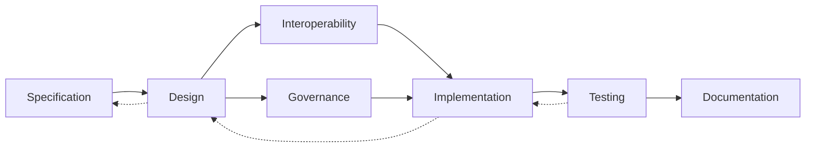

# ATN Workflow: Architecture

A workflow for refining specifications into implementable structures and building from them.

The name Architecture is used because the main outcome of this workflow is an organized solution structure: components, interfaces, allocations, responsibilities, and governing design choices that make implementation possible. In common systems engineering terminology, this corresponds to architecture design and design solution definition, followed by realization-oriented work that turns those structures into implemented and integrated artifacts.

## Why This Workflow Uses These Activities

This workflow uses these activities because each one is needed to turn required behavior into a realizable structure:

- [Specification](../../Activities/Specification) provides the constraints and intended behaviors that the architecture must satisfy.
- [Design](../../Activities/Design) refines those constraints into implementable structures, interfaces, responsibilities, and patterns.
- [Interoperability](../../Activities/Interoperability) ensures the architecture defines workable interfaces, protocols, schemas, and shared meanings across parts of the system.
- [Governance](../../Activities/Governance) establishes the rules, controls, and design decisions that keep implementation aligned with architectural intent.
- [Implementation](../../Activities/Implementation) realizes the architecture in concrete artifacts.
- [Testing](../../Activities/Testing) checks that the implemented structure behaves as intended and that design assumptions hold in practice.
- [Documentation](../../Activities/Documentation) records architectural decisions, interfaces, constraints, and implementation-relevant guidance.

Together these activities form an architecture-oriented path because they are centered on defining and realizing system structure rather than only stating requirements or only observing operations.

## Activities

- [Specification](../../Activities/Specification)
- [Design](../../Activities/Design)
- [Interoperability](../../Activities/Interoperability)
- [Governance](../../Activities/Governance)
- [Implementation](../../Activities/Implementation)
- [Testing](../../Activities/Testing)
- [Documentation](../../Activities/Documentation)

These activities are grouped because common systems engineering sources show that architecture design sits between requirements and realization, refining specifications into components, interfaces, and governing structures, then carrying those structures through implementation, testing, and documentation.

## Activity Flow

The primary flow moves from specification into realized structure, but implementation and testing frequently force revision of design decisions and sometimes of the originating specification.

## Sources

This workflow name is corroborated by common systems engineering usage in which architecture and design solution definition sit between requirements/specification and implementation/integration.

Representative sources include:

- [NASA Systems Engineering Handbook](https://www.nasa.gov/wp-content/uploads/2018/09/nasa_systems_engineering_handbook_0.pdf), which identifies `Logical Decomposition Process`, `Design Solution Definition Process`, `Product Implementation Process`, and `Product Integration Process`
- [DoD Systems Engineering Guidebook](https://www.cto.mil/wp-content/uploads/2024/05/SE-Guidebook-Feb2022.pdf), which identifies `Architecture Design Process`, `Implementation Process`, `Integration Process`, and `Technical Reviews and Audits`
- [SEBoK: Applying Life Cycle Processes](https://sebokwiki.org/wiki/Applying_Life_Cycle_Processes), which discusses architecture within system definition and relates solution synthesis to architecture, integration, verification, validation, operation, and maintenance
