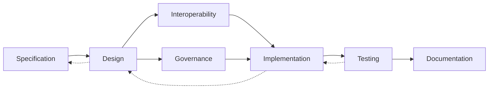

# ATN Workflow: Architecture

A workflow for refining specifications into implementable structures and building from them.

## Activities

- [Specification](../../Activities/Specification)
- [Design](../../Activities/Design)
- [Interoperability](../../Activities/Interoperability)
- [Governance](../../Activities/Governance)
- [Implementation](../../Activities/Implementation)
- [Testing](../../Activities/Testing)
- [Documentation](../../Activities/Documentation)

These activities are grouped because common systems engineering sources show that architecture and design refine specifications into implementable components and interfaces, while implementation, testing, and documentation carry that structure into realized products.

## Activity Flow

The primary flow moves from specification into realized structure, but implementation and testing frequently force revision of design decisions and sometimes of the originating specification.

## Sources

This workflow name is corroborated by common systems engineering usage in which architecture and design solution definition sit between requirements/specification and implementation/integration.

Representative sources include:

- [NASA Systems Engineering Handbook](https://www.nasa.gov/wp-content/uploads/2018/09/nasa_systems_engineering_handbook_0.pdf), which identifies `Logical Decomposition Process`, `Design Solution Definition Process`, `Product Implementation Process`, and `Product Integration Process`
- [DoD Systems Engineering Guidebook](https://www.cto.mil/wp-content/uploads/2024/05/SE-Guidebook-Feb2022.pdf), which identifies `Architecture Design Process`, `Implementation Process`, `Integration Process`, and `Technical Reviews and Audits`
- [SEBoK: Applying Life Cycle Processes](https://sebokwiki.org/wiki/Applying_Life_Cycle_Processes), which discusses architecture within system definition and relates solution synthesis to architecture, integration, verification, validation, operation, and maintenance
