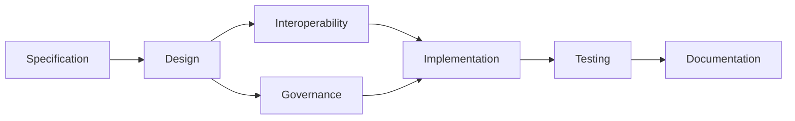

# ATN Workflow: Architecture

A workflow for refining specifications into implementable structures and building from them.

## Activities

- [Specification](../../Activities/Specification)
- [Design](../../Activities/Design)
- [Interoperability](../../Activities/Interoperability)
- [Governance](../../Activities/Governance)
- [Implementation](../../Activities/Implementation)
- [Testing](../../Activities/Testing)
- [Documentation](../../Activities/Documentation)

These activities are grouped because common systems engineering sources show that architecture and design refine specifications into implementable components and interfaces, while implementation, testing, and documentation carry that structure into realized products.

## Activity Flow

## Sources

This workflow name is corroborated by common systems engineering usage in which architecture and design solution definition sit between requirements/specification and implementation/integration.

Representative sources include:

- NASA Systems Engineering Handbook, which identifies architecture definition, logical decomposition, design solution definition, implementation, and integration as distinct but connected processes
- DoD Systems Engineering Guidebook, which identifies architecture design, implementation, integration, verification, and technical reviews as core activities
- SEBoK guidance on applying life cycle processes, which describes moving from problem definition to solution synthesis through architecture and realization activities
