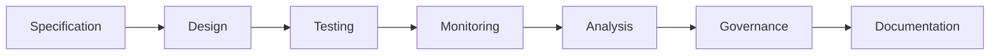

# ATN Workflow: Assurance

A workflow for checking consistency between intent, realization, and observed behavior.

## Activities

- [Specification](../../Activities/Specification)
- [Design](../../Activities/Design)
- [Testing](../../Activities/Testing)
- [Monitoring](../../Activities/Monitoring)
- [Analysis](../../Activities/Analysis)
- [Governance](../../Activities/Governance)
- [Documentation](../../Activities/Documentation)

These activities are grouped because common systems engineering guidance shows assurance as the cross-checking of specifications, realized designs, tests, and operational observations under explicit governance and documentation.

## Activity Flow

## Sources

This workflow name is corroborated by common engineering usage in which assurance covers verification, validation, technical assessment, risk, compliance, and governance concerns across the life cycle.

Representative sources include:

- NASA Systems Engineering Handbook, which distinguishes verification, validation, technical assessment, and governance-related controls across realization and operations
- DoD Systems Engineering Guidebook, which ties technical assessment, verification, validation, risk management, and system safety to assurance of delivered capability
- SEBoK guidance on applying life cycle processes, which emphasizes concurrency between design, verification, validation, deployment, and operational feedback
