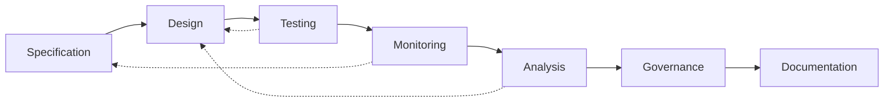

# ATN Workflow: Assurance

A workflow for checking consistency between intent, realization, and observed behavior.

The name Assurance is used because the main outcome of this workflow is justified confidence that a system satisfies its intended constraints in design, implementation, and operation. In common engineering usage, assurance is broader than testing alone: it includes verification, validation, assessment of observed behavior, governance of acceptable evidence, and documentation of findings and decisions.

## Why This Workflow Uses These Activities

This workflow uses these activities because each one contributes evidence or control needed for assurance:

- [Specification](../../Activities/Specification) defines the intended constraints and behaviors against which assurance judgments are made.
- [Design](../../Activities/Design) provides the structure whose adequacy and correctness must be assessed.
- [Testing](../../Activities/Testing) produces direct evidence about whether implemented behavior matches intended behavior.
- [Monitoring](../../Activities/Monitoring) provides evidence from actual or simulated operation, including deviations and emergent issues not captured in planned tests alone.
- [Analysis](../../Activities/Analysis) interprets test results, observations, anomalies, and residual risk.
- [Governance](../../Activities/Governance) defines criteria, controls, decision rights, and acceptance thresholds for assurance claims.
- [Documentation](../../Activities/Documentation) records evidence, findings, decisions, and traceability needed to justify confidence over time.

Together these activities form an assurance-oriented path because they are organized around producing and evaluating evidence that intent, realization, and observed behavior remain aligned.

## Activities

- [Specification](../../Activities/Specification)
- [Design](../../Activities/Design)
- [Testing](../../Activities/Testing)
- [Monitoring](../../Activities/Monitoring)
- [Analysis](../../Activities/Analysis)
- [Governance](../../Activities/Governance)
- [Documentation](../../Activities/Documentation)

These activities are grouped because common systems engineering guidance shows assurance as the cross-checking of intended constraints, realized designs, test evidence, and operational observations under explicit governance and documentation.

## Activity Flow

The primary flow checks intent against realization and behavior, but assurance findings often propagate backward into revised designs and, when needed, revised specifications.

## Sources

This workflow name is corroborated by common engineering usage in which assurance covers verification, validation, technical assessment, risk, compliance, and governance concerns across the life cycle.

Representative sources include:

- [NASA Systems Engineering Handbook](https://www.nasa.gov/wp-content/uploads/2018/09/nasa_systems_engineering_handbook_0.pdf), which identifies `Product Verification Process` and `Product Validation Process` and describes verification and validation as distinct but linked activities
- [DoD Systems Engineering Guidebook](https://www.cto.mil/wp-content/uploads/2024/05/SE-Guidebook-Feb2022.pdf), which identifies `Verification Process`, `Validation Process`, and `Technical Reviews and Audits` as core systems engineering processes
- [SEBoK: Applying Life Cycle Processes](https://sebokwiki.org/wiki/Applying_Life_Cycle_Processes), which emphasizes concurrency and iteration among design, integration, verification, validation, deployment, operation, and maintenance activities
