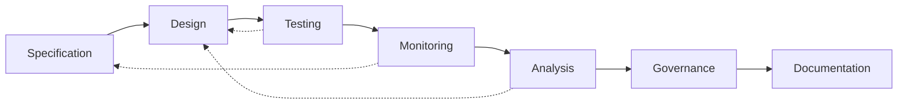

# ATN Workflow: Assurance

A workflow for checking consistency between intent, realization, and observed behavior.

## Activities

- [Specification](../../Activities/Specification)
- [Design](../../Activities/Design)
- [Testing](../../Activities/Testing)
- [Monitoring](../../Activities/Monitoring)
- [Analysis](../../Activities/Analysis)
- [Governance](../../Activities/Governance)
- [Documentation](../../Activities/Documentation)

These activities are grouped because common systems engineering guidance shows assurance as the cross-checking of specifications, realized designs, tests, and operational observations under explicit governance and documentation.

## Activity Flow

The primary flow checks intent against realization and behavior, but assurance findings often propagate backward into revised designs and, when needed, revised specifications.

## Sources

This workflow name is corroborated by common engineering usage in which assurance covers verification, validation, technical assessment, risk, compliance, and governance concerns across the life cycle.

Representative sources include:

- [NASA Systems Engineering Handbook](https://www.nasa.gov/wp-content/uploads/2018/09/nasa_systems_engineering_handbook_0.pdf), which identifies `Product Verification Process` and `Product Validation Process` and describes verification and validation as distinct but linked activities
- [DoD Systems Engineering Guidebook](https://www.cto.mil/wp-content/uploads/2024/05/SE-Guidebook-Feb2022.pdf), which identifies `Verification Process`, `Validation Process`, and `Technical Reviews and Audits` as core systems engineering processes
- [SEBoK: Applying Life Cycle Processes](https://sebokwiki.org/wiki/Applying_Life_Cycle_Processes), which emphasizes concurrency and iteration among design, integration, verification, validation, deployment, operation, and maintenance activities
