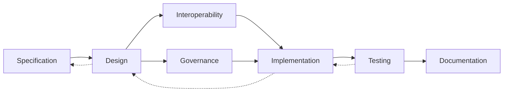

# ATN Workflow: Engineering

A workflow for refining specifications into implementable structures and building from them.

The name Engineering is used because the main outcome of this workflow is not only an architecture but a realized solution: a design organized into structures, interfaces, responsibilities, controls, implementations, and tests. In common systems engineering terminology, this workflow spans architecture design, design solution definition, implementation, integration-relevant coordination, and evidence-producing checks that move a specified system toward realization.

## Why This Workflow Uses These Activities

This workflow uses these activities because each one is needed to turn required behavior into an engineered realization:

- [Specification](../../Activities/Specification) provides the constraints and intended behaviors that the engineered solution must satisfy.
- [Design](../../Activities/Design) refines those constraints into implementable structures, interfaces, responsibilities, and patterns.
- [Interoperability](../../Activities/Interoperability) ensures the engineered solution can coordinate across interfaces, protocols, schemas, and shared meanings.
- [Governance](../../Activities/Governance) establishes the rules, controls, and engineering decisions that keep implementation aligned with intended structure and constraints.
- [Implementation](../../Activities/Implementation) realizes the design in concrete artifacts.
- [Testing](../../Activities/Testing) checks that the implemented solution behaves as intended and that engineering assumptions hold in practice.
- [Documentation](../../Activities/Documentation) records design decisions, interfaces, constraints, implementation guidance, and resulting evidence.

Together these activities form an engineering-oriented path because they are organized around designing, building, constraining, checking, and recording a realizable solution.

## Activities

- [Specification](../../Activities/Specification)
- [Design](../../Activities/Design)
- [Interoperability](../../Activities/Interoperability)
- [Governance](../../Activities/Governance)
- [Implementation](../../Activities/Implementation)
- [Testing](../../Activities/Testing)
- [Documentation](../../Activities/Documentation)

These activities are grouped because common systems engineering sources show that engineering work between requirements and operations includes architecture and design definition, interface coordination, governed realization, implementation, testing, and documentation.

## Activity Flow

The primary flow moves from specification into realized structure, but implementation and testing frequently force revision of design decisions and sometimes of the originating specification.

## Sources

This workflow name is corroborated by common engineering usage in which design, implementation, integration-oriented coordination, and testing together form the core of system realization between requirements and operations.

Representative sources include:

- [NASA Systems Engineering Handbook](https://www.nasa.gov/wp-content/uploads/2018/09/nasa_systems_engineering_handbook_0.pdf), which identifies `Logical Decomposition Process`, `Design Solution Definition Process`, `Product Implementation Process`, and `Product Integration Process`
- [DoD Systems Engineering Guidebook](https://www.cto.mil/wp-content/uploads/2024/05/SE-Guidebook-Feb2022.pdf), which identifies `Architecture Design Process`, `Implementation Process`, `Integration Process`, and `Technical Reviews and Audits`
- [SEBoK: Applying Life Cycle Processes](https://sebokwiki.org/wiki/Applying_Life_Cycle_Processes), which relates system definition to architecture, then to integration, verification, validation, operation, and maintenance through concurrent and iterative life-cycle processes
