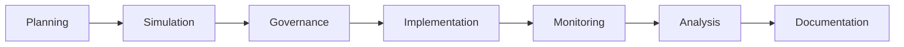

# ATN Workflow: Operations

A workflow for defining intended action, exploring scenarios, executing under constraints, and observing outcomes.

## Activities

- [Planning](../../Activities/Planning)
- [Simulation](../../Activities/Simulation)
- [Governance](../../Activities/Governance)
- [Implementation](../../Activities/Implementation)
- [Monitoring](../../Activities/Monitoring)
- [Analysis](../../Activities/Analysis)
- [Documentation](../../Activities/Documentation)

These activities are grouped because common systems engineering and operations guidance show a recurring operational loop of planning, scenario exploration, execution, observation, assessment, and documentation.

## Activity Flow

## Sources

This workflow name is corroborated by common life-cycle usage in which planning, simulation, execution, monitoring, and operational support form an operations-oriented thread.

Representative sources include:

- NASA Systems Engineering Handbook, which identifies operations and sustainment as a distinct life-cycle phase supported by planning, simulation, implementation, monitoring, and analysis
- DoD Systems Engineering Guidebook, which highlights operations, sustainment, mission execution, and technical assessment across the life cycle
- SEBoK guidance on applying life cycle processes, which emphasizes deployment, use, sustainment, and feedback across life-cycle processes
