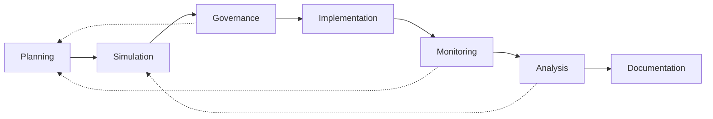

# ATN Workflow: Operations

A workflow for defining intended action, exploring scenarios, executing under constraints, and observing outcomes.

## Activities

- [Planning](../../Activities/Planning)
- [Simulation](../../Activities/Simulation)
- [Governance](../../Activities/Governance)
- [Implementation](../../Activities/Implementation)
- [Monitoring](../../Activities/Monitoring)
- [Analysis](../../Activities/Analysis)
- [Documentation](../../Activities/Documentation)

These activities are grouped because common systems engineering and operations guidance show a recurring operational loop of planning, scenario exploration, execution, observation, assessment, and documentation.

## Activity Flow

The primary flow moves from planning through execution and observation, but operational feedback often sends work back to planning, simulation, and governing constraints.

## Sources

This workflow name is corroborated by common life-cycle usage in which planning, simulation, execution, monitoring, and operational support form an operations-oriented thread.

Representative sources include:

- [NASA Systems Engineering Handbook](https://www.nasa.gov/wp-content/uploads/2018/09/nasa_systems_engineering_handbook_0.pdf), which identifies `Project Phase E: Operations` and treats operations as a distinct life-cycle area connected to analysis, validation, and sustainment concerns
- [DoD Systems Engineering Guidebook](https://www.cto.mil/wp-content/uploads/2024/05/SE-Guidebook-Feb2022.pdf), which defines systems engineering as covering specification, design, development, realization, technical management, `operations`, and retirement, and discusses operational testing and operations and sustainment
- [SEBoK: Applying Life Cycle Processes](https://sebokwiki.org/wiki/Applying_Life_Cycle_Processes), which emphasizes deployment, use, sustainment, operation, maintenance, and feedback across life-cycle processes
