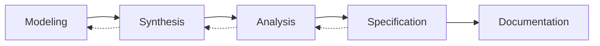

# ATN Workflow: Requirements

A workflow for turning domain understanding into precise, testable constraints.

The name Requirements is used because the main outcome of this workflow is a set of required constraints, behaviors, and acceptance-relevant statements that can guide later design, implementation, and testing. In common systems engineering terminology, this corresponds to requirements definition and requirements analysis: understanding stakeholder needs, structuring them into coherent statements, analyzing their implications, and recording them in a form that can be used downstream.

## Why This Workflow Uses These Activities

This workflow uses these activities because each one contributes a distinct part of the transformation from domain understanding to usable requirements:

- [Modeling](../../Activities/Modeling) captures domain concepts, entities, relationships, and constraints that requirements must refer to.
- [Synthesis](../../Activities/Synthesis) combines multiple concepts, concerns, and sources into a coherent candidate understanding of the problem space.
- [Analysis](../../Activities/Analysis) checks implications, consistency, completeness, ambiguity, and tradeoffs before commitments are written down as requirements.
- [Specification](../../Activities/Specification) expresses the resulting requirements as precise constraints, behaviors, and invariants.
- [Documentation](../../Activities/Documentation) records the resulting requirements so they can be reviewed, communicated, versioned, and reused by other workflows.

Together these activities form a requirements-oriented path because they move from understanding and structuring the problem toward explicit statements of what must hold.

## Activities

- [Modeling](../../Activities/Modeling)
- [Synthesis](../../Activities/Synthesis)
- [Analysis](../../Activities/Analysis)
- [Specification](../../Activities/Specification)
- [Documentation](../../Activities/Documentation)

These activities are grouped because common systems engineering sources consistently show that stakeholder needs, concept definition, and system requirements definition depend on modeling the domain, synthesizing candidate understandings, analyzing alternatives and implications, specifying the resulting constraints, and documenting them for downstream use.

## Activity Flow

The primary flow moves forward toward documented requirements, but clarification and conflict resolution often propagate backward from specification into analysis, synthesis, and earlier domain modeling.

## Sources

This workflow name is corroborated by common systems engineering usage in which requirements definition is recognized as a life-cycle activity preceding design and implementation.

Representative sources include:

- [NASA Systems Engineering Handbook](https://www.nasa.gov/wp-content/uploads/2018/09/nasa_systems_engineering_handbook_0.pdf), which identifies `Technical Requirements Definition Process` and relates it to downstream design and realization processes
- [DoD Systems Engineering Guidebook](https://www.cto.mil/wp-content/uploads/2024/05/SE-Guidebook-Feb2022.pdf), which identifies `Stakeholder Requirements Definition Process` and `Requirements Analysis Process` as core technical processes
- [SEBoK: Applying Life Cycle Processes](https://sebokwiki.org/wiki/Applying_Life_Cycle_Processes), which discusses stakeholder needs, concept definition, and `system requirements definition` as linked life-cycle processes
