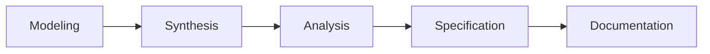

# ATN Workflow: Specification

A workflow for turning domain understanding into precise, testable constraints.

This workflow name is corroborated by common systems engineering usage in which specification and requirements definition are recognized life-cycle activities preceding design and implementation.

Representative sources include:

- NASA Systems Engineering Handbook, which distinguishes stakeholder expectations, technical requirements definition, and system design processes
- DoD Systems Engineering Guidebook, which treats stakeholder requirements definition and requirements analysis as core technical processes
- SEBoK guidance on applying life cycle processes, which identifies concept definition and system requirements definition as linked life-cycle processes

## Activities

- [Modeling](../../Activities/Modeling)
- [Synthesis](../../Activities/Synthesis)
- [Analysis](../../Activities/Analysis)
- [Specification](../../Activities/Specification)
- [Documentation](../../Activities/Documentation)

These activities are grouped because common systems engineering sources consistently show that domain understanding, synthesis, and analysis feed the definition of requirements and specifications, with documentation capturing the resulting artifacts.

## Activity Flow

