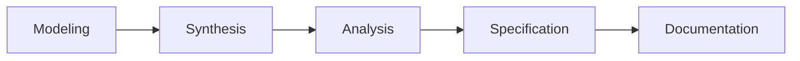

# ATN Workflow: Specification

A workflow for turning domain understanding into precise, testable constraints.

## Activities

- [Modeling](../../Activities/Modeling)
- [Synthesis](../../Activities/Synthesis)
- [Analysis](../../Activities/Analysis)
- [Specification](../../Activities/Specification)
- [Documentation](../../Activities/Documentation)

These activities are grouped because common systems engineering sources consistently show that domain understanding, synthesis, and analysis feed the definition of requirements and specifications, with documentation capturing the resulting artifacts.

## Activity Flow

## Sources

This workflow name is corroborated by common systems engineering usage in which specification and requirements definition are recognized life-cycle activities preceding design and implementation.

Representative sources include:

- [NASA Systems Engineering Handbook](https://www.nasa.gov/wp-content/uploads/2018/09/nasa_systems_engineering_handbook_0.pdf), which identifies `Technical Requirements Definition Process` and relates it to downstream design and realization processes
- [DoD Systems Engineering Guidebook](https://www.cto.mil/wp-content/uploads/2024/05/SE-Guidebook-Feb2022.pdf), which identifies `Stakeholder Requirements Definition Process` and `Requirements Analysis Process` as core technical processes
- [SEBoK: Applying Life Cycle Processes](https://sebokwiki.org/wiki/Applying_Life_Cycle_Processes), which discusses stakeholder needs, concept definition, and `system requirements definition` as linked life-cycle processes
